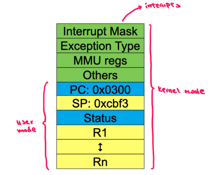
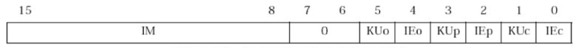
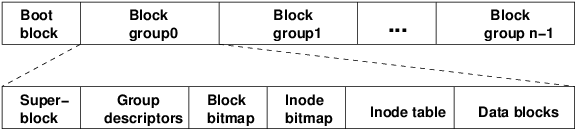

# Overview

**Roles of the OS**
1. Abstract Machine
    - hides hardware details &rarr; programmers to write device independent applications
    -  i.e. file system instead of registers
2. Resource mananger
    - management and allocaton of the computer's resources to processes
      - i.e. CPU, memory, disk drivers...
    - ensures progress and no starvation
 
 **Kernel**
   - portion of the OS running in previledged mode
   - loaded into main memory (RAM) and remains there
   - facilitates safe interactions between software and hardware
 
 **Structure of the OS**
   - userland: where applications are executed
   - kernel: access to all the hardware in the computer
   - systems calls exists to allows applications to interact with hardware sources

**Timer Interrupt**: process's time slice is up
  1. kernel regains control
  2. scheduler chooses the next ready process 
  3. context switch and gives control of CPU to that process

**OS Software**
  - OS functions are machine code programs with more priviledges
  - Execution of an application:
      1. OS places the application into RAM
      2. OS gives control of the CPU to the process running the application
      3. OS retrieves control when either
          - system calls are made
          - timer interupts
         
**OS Requirements** 
- Interleaving execution of processes 
    - maximise CPU ussage
- Interprocess communication
    - process A can notify process B that an event has occur via synchronisation primitives 
- Can allocate resources to applications
- Allow users to create processes

# Processes & Threads

<table border="0">
 <tr>
    <td><b style="font-size:30px">Process</b></td>
    <td><b style="font-size:30px">Thread</b></td>
 </tr>
 <tr>
    <td>execution of a program</td>
    <td>unit of execution </td>
 </tr>
 <tr>
    <td>contains threads</td>
    <td>belongs to a process</td>
 </tr>
  <tr>
    <td>owner of the resources allocated</td>
    <td>operate on the resources allocated</td>
 </tr>
</table>

**Logical Execution Trace**
- From perspective of each process, they are executed from start to finish without stoppage
  - Creates allusion that multiple process are running at the same time
  - Oblivion to the sys calls & interrupts
- Only one program is active at any instant

**Scheduler**
- Queue system responsible for choosing the next ready process to run
- Eeach event (i.e. netword traffic) has its own queue 

**Process Memory Layout** (shared amongst threads)
- text: code executed by CPU
- data: global variables (grows up)
- stack: local variables (grows down)

**User / Kernel mode**

<table border="0">
 <tr>
    <td><b style="font-size:30px">User Mode</b></td>
    <td><b style="font-size:30px">Kernel Mode</b></td>
 </tr>
 <tr>
    <td>Processes scheduled by the kernel</td>
    <td>Activity is associated with a process</td>
 </tr>
 <tr>
    <td>Isolated from each other</td>
    <td>Kernel memory is shared between processes</td>
 </tr>
  <tr>
    <td>No concurrency issues </td>
    <td>Concurrecny issues arise when process concurrently executing in a system call</td>
 </tr>
</table>

**Thread items**
- saved registers, program counter, stack pointer
- stack: local variables, return address 
- state: running, blocked, ready

**Threading Models**
1. Single Threaded
    - Can only do one thing at a time &rarr; process will blocked if no progress can be made
        - chef cooks fries and waits until its finished before moving onto burgers 
2. Multithreaded 
    - Multiple activities can be parallelised 
    - Overlap I/O with execution &rarr; CPU can always run a thread that is not blocked
        - chef on fries, chef on burger and server for customers
        - can always serve new customers even if food not ready
3. Event Model (Async)
    - Thread initiates and I/O operation to execute in the background. 
    - Immediately returns to waiting for events
    - When an operation is complete, thread is interrupted to handle the result 
   
  https://courses.cs.vt.edu/cs5204/fall09-kafura/Presentations/Threads-VS-Events.pdf

**Process Control Block (PCB)**: Data structure used to store information about a process
- used by the OS to manage and execute processes when CPU is free
- contains process id, state, registers, open files etc

**Thread Control Block (TCB)**: Data structure within the kernel which contains information about a thread
- contains thread id, state, program counter, register, pointer to a PCB, etc 

**User Level Threads**                                                                 
- Implemented in the user level using library functions
- OS has no knowledge of user level threads (it sees only a single process)
- If a thread is blocked waiting for another thread in the same process, its state is saved and the dispatched switches to a ready thread.

<table border="0">
 <tr>
    <td><b style="font-size:30px">Pros</b></td>
    <td><b style="font-size:30px">Cons</b></td>
 </tr>
 <tr>
    <td>Thread management is more performant and lightweight (library) </td>
    <td>Limited to cooperative multithreading (no timer interrupt) </td>
 </tr>
 <tr>
    <td>Threads can be synchronised without the OS</td>
    <td>Does not take advantage of multiple CPUs</td>
 </tr>
  <tr>
    <td>OS indepedent </td>
    <td>If thread makes a blocking system call, the whole process blocks</td>
 </tr>
</table>


**Kernel Level Threads**
- Implemented by the kernel and offered to applicaitons as an API
- Information about a thread is stored in kernel TCB
- Threads are managed using system calls such as create, wait, exit, etc

<table border="0">
 <tr>
    <td><b style="font-size:30px">Pros</b></td>
    <td><b style="font-size:30px">Cons</b></td>
 </tr>
 <tr>
    <td> Allows for pre-emptive multithreading </td>
    <td> Creating new threads is expensive </td>
 </tr>
 <tr>
    <td> Can overlap blocking I/O with computation </td>
    <td> Synchronisation requires crossing between user / kernel space (expensive) </td>
 </tr>
  <tr>
    <td> Can take advantage of multiprocessors </td>
    <td></td>
 </tr>
</table>

**Pre-emptive multithreading**: Timer interrupts will be automatically issued by the OS to prevent a process from holding on the CPU.

# Concurrency
  
**Concurrency**: 
  - Ability to executes parts of a program out of order without affect the final result
    - Allows parallel execution of concurrent threads &rarr; improve performance in multi-processor systems
  - No assumptions can be made about 
     1. relative progress of concurrent processes / threads
     2. divisibility of an instruction 
  - Occurs in multiple processes with a single thread OR a single process with multiple threads
  
**Critical Region**
  - Region of code where shared resources are accessed
  - Uncoordinated entry into a critical region &rarr; race condition &rarr; incorrect behaviour 

**Critical Region Requirements**
1. Mutual Exclusion (lock): allowing only one thread to access the critical region at any one time
2. Progress: no process outside a critical region can block another process
3. Bounded: all threads should eventually be able to enter their critical regions

**Disabling Interrupts** Disable before entry & renable after exit 
- Poor solution as applications can be written such that interrupts are not renabled after exit 
- Kernel may not be able to regain control 

**Atomic Instructions**
- Hardware instructions provided by the microprocessor guaranteed to be atomic
- Example: Test & Set Instruction: write to memory location & return its old value
``` C
  int key = 0;  
  void makeMattRich(int accNo, int money) 
  {
      while (testAndSet(&key, 1) == false) { };    // blocked until thread has access to key
          
      int mattHas = get_bal(accNo);
      mattHas = mattHas + money;                    // atomic
      update_bal(accNo, mattHas);
      
      testAndSet(&key, 0);                         // reset key => another process can enter 
      notifyMatt(mattHass);
  }
```
- Busy Waiting: CPU time is wasted waiting for a thread to acquire the lock
- Single core ussage &rarr; busy waiting prevents thread in the critical region to make progress

# Synchronisation Primitives

**Lock**: threads acquire / release a lock when entering / leaving a critical region
  - Spin lock (above code): use only in multi core systems **OR** if the critical region is short 
  
**Semaphore**: control concurrent access to common resources by multiple threads
  - Processes trying to access the resource that the semaphore is protecting will be placed into a waiting queue `P()` if it's not available 
  - When a resource is ready, any process waiting for that resource will be woken up `V()` 
  - Number of processes allowed to progress before blocking is determined by `semaphore.count`
   
**Monitor**: Special module that allow only one method to be inside at any time
  - All shared resources inside are private AND all code inside is mutually exclusive 
  
**Condition Variable**: signalling devices that allows threads to communicate with each other about the state of a condition
  - `cv_wait` will place a thread to sleep until a condition is met
  - `cv_signal` will wake a thread up and allow it to resume execution  

# Deadlock

**Deadlock**: A state in which no processes can progress because each process is waiting for an event that only anoher process can trigger.

**Deadlock Requirements**: 
1. Mutual Exclusion: only one process can access a resource
2. Hold & Wait: process holding a resource can request addition
3. No Pre-emption: resource previous obtained by a process cannot be taken away before completion without side effects
4. Circular Wait: two or more processes in a chain where each is waiting for a resource held by the next member in the chain

**Livelock**: A state in which processes are not blocked but never makes progress
- Two processes are trying to access the same file. However, each process surrenders the access to file if the other process has not yet accessed the file.

**Deadlock solutions**
1. Ignore Deadlocks
    - reasonable if deadlocks rarely occur and or cost of prevention / recovery is high
    - tradeoff between correctness & convenience
2. Deadlock Prevention: enforce resource allocation rules such that a deadlock condition cannot occur 
    - no ME: not plausible since some resources cannot be shared
    - no H&W: process requests all resources needed before starting &rarr; process is never waiting
        - not always possible to determine
        - holds up resources that can be used by other process until it completes
        - **variation**: surrender all resources if it's blocking another process &rarr; livelock
    - no PE: not plausible
    - no CW: can be achieved by resource ordering
        - resources must be acquired in order (`x &rarr; y`): if `y` is needed, `x` must be acquired first 
3. Deadlock Detection & Recovery: 
    - apply deadlock detection algorithm to determine if system is deadlocked
    - recover and restore progress by rolling back
    - adds overhead to the OS
4. Dynamic Avoidance:
    - Acquire the maximum of each resource remaining before start
        - not always possible since it's dependent on input
    - Only grant further resource requests if it leads to a safe state 

**Deadlock Detection & Recovery**
- Invariant:  
- Detection Algorithm: GET IMAGE FROM KUAKERR

**State Safety**:
- System is currently not deadlocked AND remaining resources can be allocated in some order such that all process can complete even if they request for the maximum of a resource
- Checking state safety: Suppose all processes request the maximum of a resource, can the resources be allocated such that all processes can complete 

**Starvation**: 
- Process never receives the resource that it needs despite the resource repeatedly becoming available. The resource is always allocated to a process of higher priority.

**Branch Delay**: Instruction after a branch or jump is always executed prior to destination of jump 
```MIPS
    j       1f
    li      r2, 2           // branch delay slot
    li      r2, 3           // branch delay slot
1:  sw      r2, (r3) 
```

# Context Switch

**Definition**: Storing and restoring the state associated with a process / thread
- Essential in enabling multiple process to share the same CPU

**Causes of a context swtich**:
- System call: block or on exit()
- Exception: 
- Interrupt: timer interrupt causing the scheduler to execute another process

**Requirements of a context switch**:
- Transparent for process / threads: they should not noticing something else is running while they're dispatched
    - switching between user-level threads from the thread's perspective = sequential execution
- OS must save all state involved 

**Procedure of a context switch**:
1. Process running in user mode &rarr; sp pointing to user-level stack
2. On exception, syscall or interrupt &rarr; sp pointing to kernel stack
3. Trapframe is pushed onto the stack and sp is moved downwards 
4. Execute C code to handle exception, syscall or interrupt &rarr; C activation stack builds up (down)
5. Kernel chooses a target thread / proceess and the remaining kernel state is pushed onto the stack
6. Current sp is stored in the PCB or TCB and sp of the target thread is loaded &rarr; context switched
7. Rewind through the stack of the target (kernel state &rarr; C activation stack &rarr; trapframe &rarr; user mode)

**Trapframe**: Stores all the registers used by the process that called switch

# System Calls

**Basics**:
- Special function calls that provided controlled entry into the kernel from the user space
- Perform privileged operations (access devices, network files etc) and return user mode with result 
- Syscall interfance represents the abstract machine provided by the OS
- Regular function calls cannot enforce security checks

**Previleged Mode Operation**:                                                   
- System, kernel-mode: all instructions and registers are available                
- user-mode: only a subset of the instruction set and only safe registers   
    - affect only the application                                                        
    - cannot interfere with OS (i.e. cli on x86 can disable interrupts)                                                      

|

**System Call Procedure**:

**Coprocessor 0 (cp0)**:
- Contains exception / interrupt management registers
- Manipulated using kernel instructions `mtc0` and `mfc0`

**c0_status**:

|
- KU: 0 = kernel and 1 = user mode
- IE: 0 = interrupts off and 1 = interrupts enabled
- KU and IE bits are shifted left per each exception
- c, p, o = current, previous, old

**c0_cause**:


- ExcCode = code number of the exception
    - 0 = interrupt and 8 = system call

**c0_ecp**:
- Exception program counter which points to address of where to restart execution after handling an exception

**Exception Vector**: Stores the code required to handle different exceptions

**Hardware Support for Exception Handling**:
1. Executing code stored at pc in user mode and interrupts on. Interrupts occurs.
2. Instruction at pc is stored into the epc 
3. KU and IE bits in the status register is shifted to the left so `KUc` and `IEc` are 0 (disabled)
4. Exception code is placed into c0_cause (i.e. 0 for interrupt)
5. Address of exception vector placed into pc (cpu now running code in pc in kernel mode with interrupts off)
6. HANDLES THE EXCEPTION
7. Load the address stored in the epc back in the pc and call the `rfe` instruction to shift status bits to the right
8. cpu now running the code in the same state as when the exception occurred


**Loading the epc**:
```MIPS
lw r27, saved_epc
nop
jr r27
rfe
```

# File System

**File System Abstraction**:

<table border="0">
 <tr>
    <td><b style="font-size:30px">User's View</b></td>
    <td><b style="font-size:30px">File System</b></td>
 </tr>
 <tr>
    <td> Uniform namespace (universal file sysyem) </td>
    <td> Collection of storage devices </td>
 </tr>
 <tr>
    <td> Hierarchical structure </td>
    <td> Flat address space </td>
 </tr>
  <tr>
    <td> Arbitrary file sizes </td>
    <td> Fixed sized blocks </td>
 </tr>
 <tr>
    <td> Symbolic filenames  </td>
    <td> Numerical block addresses (numbers) </td>
 </tr>
 <tr>
    <td> Access control </td>
    <td> No access Control </td>
 </tr>
 <tr>
    <td> Tools for formatting, defragmentation, backup, consistency checking </td>
    <td> </td>
 </tr>
</table>

**FS Basics**:
- Filename: convenient textual naming scheme provided by the FS
- File structure: sequence of bytes
- File types: regular files, directories and device files
- File access types:
    - sequential: every instance must read from beginning (no jumps)
    - random: bytes can be read in any order by moving the file pointer (lseek)
- File attributes: protection, owner, flags, time, size etc
- File operations: create, delete, open, ...


**File Organisation and Access**:
- OS suppors unstructured files by organising its content using the ELF format 
- Criterias for designing file layout
    - rapid acess
    - ease of update
    - storage efficiency
- Performance is limited by seek time and rotational delays
    - keep blocks likely to be accessed together close to each other


**Hierarchical Structure and Directories**:
- Directories are special files owned by the OS to provide mappings between filenames and inodes
- Files can be located by following down a path from the root through directories
- Filenames don't have to be unique as long path is unique 


**Unix Storage Stack**:
- File descriptor / Open file tables:
    - Manage / trakck files opened by user level processes 
    - Match system call interface to VFS calls
- Virtual file system (VFS):
    - Presents an unified interface to the mutliple file systems attached
- File sytem:
    - Presents a directory hierarchy that hides the physial location of data on the disk
    - Interact with the blocks provided by the device drivers to create higher abstractions
- Buffer cache: 
    - Keep recently accessed disk blocks in memory to optimise repeated access
- Disk scheduler:
    - Prioritise waiting requests that fetch blocks closer to each other on the driver 
- Device driver:
    - Hides the details of the hardware
    - Presents a sequential interface to the disk for higher software layers
- Disk controller: 
    - Abstracts the circulary structure and geometry of the disk to a linear seqeunce of blocks
    - Provides the interface between the hard-disk and the device driver  
- Hard disk: 
    - Platters containing tracks and sections 

**File System Implementation Requirements**:
- Must map symbolic filenames to a collection of block addresses on the disk
- Track which blocks belong which files
- Track the order in which files are formed from blocks
- Track which blocks are free for allocation

**Internal Fragmentation**: 
- Space wasted within the allocated memory region
- Allocated region may be bigger than memory required (size difference is wasted)

**External Fragmentation**:
- Space wasted outside the allocated memory region
- Enough memory space exist to accomodate a request however it's not usable since non-contiguous

**Trade-offs in FS block sizes**:
- Large blocks require less metadata to be stored
- Smaller blocks wastes less disk space (fewer internal fragmentation)
- Sequential access:
    - larger block size &rarr; fewer I/O operations
- Random access:
    - larger block size &rarr; more unrelated data per load

### File Allocation Methods
**1. Contiguous Allocation**:
- Tracks only the address of the starting block and the length of the file
- Increase performance for sequential operations
- Require max file system at the time of creation (cannot grow)
- Deleting files leads to  external fragmentation

**Dynamic Allocation Stratigies**:
- Disk space is allocated on demand so no pre-allocation is required
- Allocation occurs in fixed-size blocks
- No external fragmentation but potentially internal fragmentation (blocks not fully utilised)
- File blocks are scattered across the disk (reduced performance)
- May require the manipulation of complex datastructures

**1. Linked List Allocation**:
- Each block contains a pointer to the next block in the chain 
- Best for sequential access and does not offer random access
- No external fragmentation
- Files can continue to grow in size as long as there are free blocks
- Blocks end up scattered across the disk due to (allocs and frees) &rarr; decrease file access performance 

**2. File Allocation Table (FAT)**:
- Keep a map of the entire FS in a table where each entry stores the number of the next block of the file 
- Table is stored in disk and replicated in memory to provide fast random access 
- Requires lots of memory for large disk 
- Searching for a free block is slow 

**3. Inode Based FS**:
- Each file has a table that maps inodes to disk block numbers
- Only store table for open files in memory 
- Fast random access like FAT 
- I-nodes are allocated dynamically so strategies are required to find free spaces within the disk
    - Free block list: linked list of all the free blocks in disk that are stored in free blocks so no space wasted
    - Bit Table

### Directory Implementation
- Stored like normal files inside data blocks
- FS assigns special meaning to the content of these files 
    - each directory file is a list of directory entries
    - each entry contain filename, attributes and i-node (map filename to disk blocks)
    
**fixed-size directory entries**: either too small or too big (waste space)

**variable-size directory entries**: freeing directory entries can create external fragmentation

**searching directory listings**: Linear scan, hash lookup, b-tree

### Virtual File System

**Motivation**:
- Systems need to support multiple file system types however modifying system code to understand each is inconvenient
    - Provide single system call interface for different file systems 
- Provide framework that separates file system independent code (interacting with `vfs` & `vnodes`) and file system dependent code (dealing with `inode`)

**Struct vfs**:
- fs independent fields:
    - metadata: block size, max file size etc 
- fs_data:
    - inodes, superblock address etc
- vfs_ops:
    - getroot, read, write etc

**Struct vnode**:
```C
struct vnode {
    int ref_count;                  // number of references to this vnode by file descriptors
    struct spinlock countlock;      // lock to achieve mutual exclusion
    struct vfs / fs *vn_fs;         // pointer to above struct
    void *data;                     // FS specific vnode data (e.g. memory copy of inodes)
    
    const struct vnode_ops *ops;    // array of vnode functions
}
```

**File Descriptors**:
- Each open file has a corresponding file descriptor
- `vnode_ops` uses file descriptors to determine which files to operate on 
Each file descriptor contains:
    - file pointer: off_set to where the next operation (e.g. `read`) occurs at
    - mode: how the file must be used (e.g. readonly)

**FD & OF Table Designs**:
1. Vnode number as a file descriptors:
    - each number has an associated file pointer to the vnode
    - problem:
        - concurrently opening the same file system does not return 2 separate file descriptors 
    - 
2. Single global open file array
    - each index is a file_descriptor
    - each entry contains a file pointer and pointer to a vnode
    - problem:
        - fd 0-2 should be different per process however there is only one of each in this design
3. Per process file descriptor table
    - Each process has its own open file array and each entry contains a fp and pointer to vnode
    - problems:
        - forking produces a child process that shares the same file pointer as the parent
        - dup2 produces a new file descriptor that shares the same file pointer as the old
            - in the current design, the file pointers will not be synchronised in both cases
4. Per process file descriptor table with global open file table
    - Each process has its own file descriptor table and each entry contains 
        - read / read permissions
        - in use status
        - pointer to an open file
    - All processes share access to the global open file table and each entry contains
        - pointer to vnode
        - number of file descriptors pointing it 
        - file pointer
    - Resolves all the aforementioned problems 


**Buffer**:
- Temporary storage used to transfer data from two entities (e.g. application and disk)
- Stored in kernel RAM for performance
- Use when speed of receiving and processing data is different

**Cache**:
- Fast storage (typically RAM) used to temporarily store data to improve performance for repeated access to the same data
    - unused kernel memory space that may change in size depending on current memory demands
- Before loading a block from disk, check if it's in cache to prevent disk access and improve performance

**Buffering disk blocks**:
- read-ahead can be implemented by pre-loading the next required block into the kernel buffer
    - loading disk blocks into buffer before the application needs it
    - avoid waiting for the next read instruction  
Applications wishes to write a file to disk however its size may not match a full block
1. Application issues the request and writes to the buffer
2. Immediately return back to the program to resume execution and avoid waiting for write to complete
3. The entire block of where the write occurs is transferred into the buffer and updated
3. OS arranges for the entire block to be written back to disk in the backround
- 2 and 3 occur at the same time to improve performance 

**How buffering is related to caching**:
- Data is always read into the buffer since having another copy inside the cache is wasteful
- After use, block should be cached so future access can hit the cached copy instead

**Unix Buffer Cache**:
- On read: hash the device number and block number &rarr; check if match in buffer cache 
    - yes &rarr; used cached copy
    - no &rarr; follow the collision chain
        - if not found &rarr; load block from disk into buffer cache
- Policy must exist to be able to read in new blocks by replacing existing blocks when the buffer cache is full
    1. FIFO: does not reflect access pattern
        - first thing read in ≠ first thing not needed
    2. LRU: not strict LRU
    
 **File system consistency**:
 - When an application writes to disk, the data is expected to survive and make it to the file
 - Strict LRU will keep critical file system data in memory forever if they're frequently used
    - cached disk blocks are prioritised based of how critical they are to the file system consistency
    - usually scheduled for immediate write to disk
- Losing directory, inode blocks etc can corrupt the FS 
- Data blocks that corrupt only the file they're associated with are scheduled periodically to write back to disk (unix: 30 seconds)
 
### Ext2 File System

**Features**
- Block size (1024, 2048, 4096)
- Inode based 

**Inode**
- Each file is an inode on disk
- Each inode has an unique number and contains
    - metadata: access rights, owner, mode, time, ...
    - block index table of a file
    - size = offset of highest byte written to the file 
- Directories map filenames to inode numbers
 
 **Inode Blocks**
- Direct blocks: 
    - block numbers for the first 12 blocks
    - most files are small &rarr; all of its contents will be here
- Single indirection:
    - stores a block number of a block containing more block numbers
    - requires two disk access 
    - max file size = 268 KiB
- Double and triple indirections follows the same idea

**Inode Block Accessing Scheme**
- Find the binary offset by taking the base of each indirection level as 0
- Use the binary offset as index to traverse through the indirection levels 

**Worst Case Access Patterns for Allocated Inode**
- read 1 byte: 4 accesses in triple indirect
- write 1 byte: 4 reads and 1 write in triple indirect

**Worst Case Access Patterns for unallocated Inode**
- watch again lect11 (pg 29)

### s5fs 

**Disk Layout**
- Boot block: contains code to bootstrap (load) the OS
- Super block: contains information about the file system itself 
    - number of inodes, free block and inode list, ...

**Problems**
- inodes at the start and data blocks at the end &rarr; long seek time (travel from inode to block)
- corrupt the only superblock then the entire FS is corrupt
- suboptimal block allocation: eventually resulted in random allocation
- inode free list also randomised over time

### Berkeley Fast File System (FFS)

**Disk Layout**
- collection of equally sized and structured block groups



**Layout of a Block Group**
- superblock:
    - replicated in each group to aid recoverability &rarr; no longer vulnerable to one superblock becoming corrupted
    - overall free inode and block counters
    - metadata indicting whether system checks are required
        - unclean unmount, inconsistency, regular checks based on last unomount and time
- group descriptor:
    - replicated in each group to aid recoverability
    - location of the bitmaps
    - counters for free blocks and inodes in this group
    - number of directories 
- data block bitmap: which data blocks are free or in use
- inode bitmap: which inodes are free or in use

**Performance Improvements**
- block groups place related inodes and data blocks close to each other &rarr; less distance in disk
- pre-allocate up to 8 blocks on write &rarr; better contiguity for content written
- store files within a directory in the same group 

**Ext2fs Directories**
- special file managed by the kernel
- translate filenames to inode numbers
- deleting inode entries
    - setting inode number to 0
    - add length of current inode to length of previous inode

**Hard Links**
- same inode can have multiple names
- when deleting a file by name (removing the directory entry), the FS will delete the underlying inode ⇔ reference count = 0
- hard links cannot be made to files you don't own

**Symbolic Links**
- file that contains a reference to another file or directory
- contains inode and datablock that has a path to the target file
- marked by special file attribute
- can point across FS boundaries (i.e. access files between FS)

**File System Reliability**
- disk writes are buffered in RAM
    - OS crash / power outage &rarr; data lost
    - 3 points of failures are directory entry &rarr; inode &rarr; data blocks
    - writes are periodically committed to disk (i.e. every 30 desconds)
    - `sync` command to force a flush
- FS operations are not atomic
    - incomplete transaction &rarr; FS can become inconsistent & data may be lost
- e2fsck: scans disk after unclean shutdown & attempts to restore FS invariants
- Journalling FS
    - FS updates are kept in a journal
    - replay last journal entries upon unclean shutdown

### Ext3 File System

**Motivation**
- add journalling capabilities to ext2fs
- backwards & forward compatibility with ext2 to build upon its proven performance
- reuse most of the ext2 codebase and tools

**Journalling Approaches**
<table border="0">
 <tr>
    <td><b style="font-size:30px"> Journal FS Data Structure Updates </b></td>
    <td><b style="font-size:30px"> Journal FS Disk Block Updates </b></td>
 </tr>
 <tr>
    <td> ✅ efficient use of journal space </td>
    <td> ❌ even small updates can add a whole block to the journal </td>
 </tr>
 <tr>
    <td> ❌ individual updates are executed separately </td>
    <td> ✅ updates to the same block can be aggregated to a single update </td>
 </tr>
  <tr>
    <td> ❌ journalling layer must understand FS semantics </td>
    <td> ✅ journalling layer is FS independent(easy to implement) </td>
 </tr>

</table>

**Journal Block Device (JBD)**
- JBD is the ext3 journalling layer
- Interface
    - start: start a transation
    - update: update a disk block 
    - complete: completed transactions are buffered in RAM
    - commit: write transaction data to the journal 
    - checkpoint: flush the journal to disk
- can be stored on a block device or file &rarr; ext2 compatibility
- independent of ext3 specific data structures 
    - JBD is only concerned with journalling
    - can be used by any FS that requires journalling

**Journalling Mode**
- metadata + data
    - enforces atomicity of all FS operations
- metadata journalling
    - data blocks are written directly to disk
    - improve performance since the data does not need to be written to JDB
